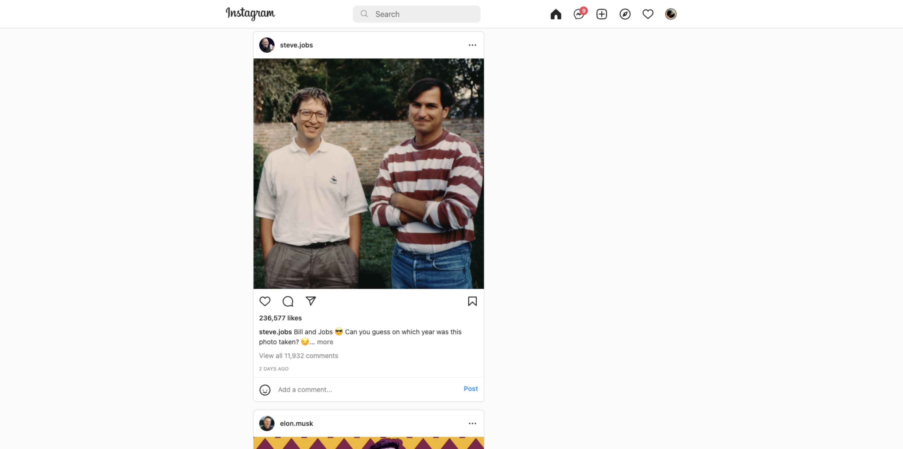

## Screenshots

## Tools

- HTML
- CSS
- Bootsrap

## Features

- Instagram clone with only Bootstrap

## Beginning

Clone this repository on your local machine.
 
`git clone https://github.com/umutzengi/InstagramCloneProject.git`

## Use

To use it after cloning the project:
 
`cd InstagramCloneProject`
 
`code .`
 
`Install VSCode Live Server extension`
 
`Click Go Live button on your right bottom corner`
 
These instructions will get a copy of the project up and running on your local machine for development and testing purposes.

## For more information

You can learn more about Bootstrap from here : <a href="https://getbootstrap.com/docs/5.3/getting-started/introduction/">Bootstrap Documentation</a>
